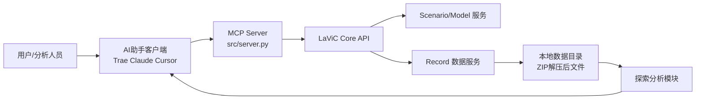
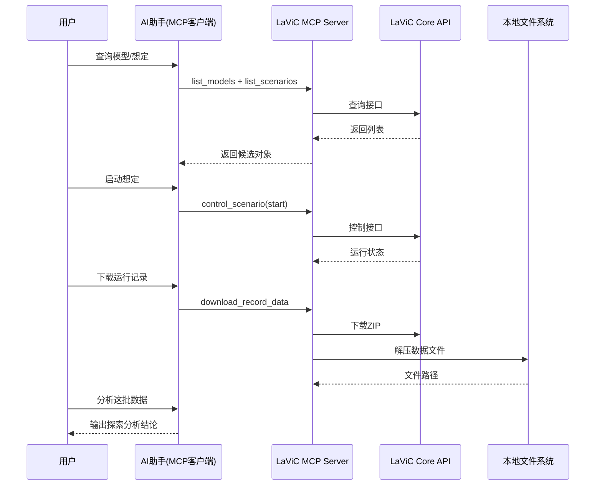

# PRD - LaViC + MCP 探索分析能力（Story1）

> 文档用途：作为需求归档、研发实现、测试验收和跨团队协作依据。
> 版本：v0.1.0（草稿）
> 更新时间：2026-02-25

---

## 0. 文档信息

- 产品名称：LaViC MCP 探索分析能力
- 项目代号：LAVIC-MCP-STORY1
- PM：待补充
- 关联仓库：[LaViCDocs](https://github.com/GaeainCloud/LaViCDocs)
- 目标上线时间：待补充

---

## 1. 论证必要性

### 1.1 业务必要性

1. 目标用户群体已普遍使用 AI 工具，具备自然语言交互习惯，是产品形态升级基础。
2. 传统体系仿真 GUI 操作复杂、学习成本高，MCP 能把高频流程抽象成自然语言任务，显著降低操作门槛。
3. 抢占 AI + 仿真控制生态位，提前沉淀接口标准、数据管线和分析闭环能力。

### 1.2 机会判断

- 当前能力已验证：用户可对仿真结果进行探索性分析。
- 下一步价值：把“能分析”升级为“可复用的标准流程（查询 -> 控制 -> 拿数据 -> 分析）”。

---

## 2. 用户与核心任务

### 2.1 目标用户

| 角色 | 典型诉求 | 现状痛点 |
|---|---|---|
| 仿真工程师 | 快速定位可用模型/想定并执行运行 | GUI 路径深、操作步骤多 |
| 分析人员 | 获取运行记录并快速出结论 | 数据导出和分析链路割裂 |
| 技术管理者 | 确保流程可复制、可审计 | 缺少统一的工具调用标准 |

### 2.2 用户要完成什么（JTBD）

用户通过 LaViC + MCP 完成：
- 查询可用模型案例与想定案例。
- 控制想定运行状态（start/pause/resume/stop）。
- 获取运行记录数据。
- 对数据做探索性分析并形成结论。

---

## 3. Story1 目标与范围

### 3.1 Story1 目标

构建一个完整闭环：
- 从查询资源到控制运行，再到数据下载和分析输出，全流程可由自然语言驱动。

### 3.2 In Scope

- 模型/想定案例查询（含分页拉取）。
- 想定运行控制。
- 运行记录下载与解压。
- 基于运行数据的探索分析输出（表格/摘要/结论）。

### 3.3 Out of Scope

- 新模型训练与参数自动调优。
- 生产级自动决策闭环（无人值守）。
- 跨系统统一身份平台改造。

---

## 4. 功能需求（Story1）

| 需求ID | 模块 | 标题 | 优先级 |
|---|---|---|---|
| REQ-001 | 查询 | 查询 LaViC 模型案例与想定案例 | P0 |
| REQ-002 | 控制 | 控制想定运行（start/pause/resume/stop） | P0 |
| REQ-003 | 数据获取 | 下载运行记录并可直接用于分析 | P0 |
| REQ-004 | 分析 | 对运行数据完成探索性分析并输出结论 | P0 |
| REQ-005 | 接入配置 | 标准化 MCP 部署与客户端 JSON 配置 | P1 |

### REQ-001 查询 LaViC 模型案例与想定案例

- 目标：用户在一个会话内找到可执行对象。
- 对应 MCP 能力：`list_models`、`list_scenarios`。
- 关键规则：
  1. 支持关键词筛选。
  2. 支持分页，支持 `fetch_all=True` 拉全量。
- 验收标准：
  1. 输入“有哪些模型案例/想定案例”可返回列表。
  2. 返回结果包含关键标识字段（如 id、名称、状态）。
  3. 分页场景下可完整获取所有数据。

### REQ-002 控制想定运行（start/pause/resume/stop）

- 目标：通过自然语言完成想定生命周期控制。
- 对应 MCP 能力：`control_scenario`。
- 关键规则：
  1. 仅允许对白名单状态执行合法动作。
  2. 执行后返回最新状态与时间戳。
- 验收标准：
  1. start/pause/resume/stop 均可执行。
  2. 非法状态转换有明确错误提示。
  3. 控制结果可追踪（操作人、动作、时间）。

### REQ-003 下载运行记录并可直接用于分析

- 目标：将运行数据从系统中稳定拉取到本地分析链路。
- 对应 MCP 能力：`download_record_data`。
- 关键规则：
  1. 支持 ZIP 自动解压。
  2. 下载失败可重试并提示失败原因。
- 验收标准：
  1. 下载成功率 >= 98%。
  2. 下载结果包含可解析数据文件。
  3. 文件路径与会话上下文可关联。

### REQ-004 对运行数据完成探索性分析并输出结论

- 目标：拿到数据后 5 分钟内输出初步分析。
- 关键规则：
  1. 至少输出：数据概览、关键指标、异常点、初步结论。
  2. 支持追问（如“按时间段再看一次”）。
- 验收标准：
  1. 单次分析包含结构化段落（概览/发现/结论）。
  2. 可追溯到输入数据文件与分析参数。
  3. 用户可对结果继续迭代提问。

### REQ-005 标准化 MCP 部署与客户端 JSON 配置

- 目标：降低其他用户接入成本。
- 关键规则：
  1. 发布包默认排除 `.env` 与 `__pycache__`。
  2. README 提供一键化最小步骤。
  3. `src/server.py` 路径与配置示例一致。
- 验收标准：
  1. 新用户按 README 可在 30 分钟内接通。
  2. 配置错误能定位到具体字段（path/token/base_url）。

---

## 5. MCP 与 LaViC 架构

### 5.1 代码结构（已提供）

```text
LaViCMCP/
├── src/
│   └── server.py          # MCP 服务端核心
├── scripts/               # 临时脚本归档
├── docs/                  # API 文档
├── .env                   # 本地配置（含 Token）
├── .env.example           # 分发模板
├── requirements.txt       # 依赖
└── README.md              # 使用说明
```

### 5.2 运行架构图



### 5.3 关键时序（Story1）



---

## 6. 配置与接入要求

### 6.1 对外分发步骤

1. 打包 `LaViCMCP/`（排除 `.env`、`__pycache__`）。
2. 执行 `pip install -r requirements.txt`。
3. 复制 `.env.example` 为 `.env` 并填写：
   - `LAVIC_API_BASE_URL`
   - `LAVIC_USER_ID`
   - `LAVIC_API_TOKEN`
4. 在 MCP 客户端添加 JSON 配置。

### 6.2 MCP 客户端 JSON（示例）

```json
{
  "mcpServers": {
    "LaViC": {
      "command": "D:\\AIProduct\\GaeainCloud\\LaViCDocs\\LaViCMCP\\.venv\\Scripts\\python.exe",
      "args": [
        "D:\\AIProduct\\GaeainCloud\\LaViCDocs\\LaViCMCP\\src\\server.py"
      ],
      "env": {
        "PYTHONIOENCODING": "utf-8"
      }
    }
  }
}
```

---

## 7. 非功能与风控要求

| 类别 | 要求 |
|---|---|
| 性能 | 查询/控制接口 P95 < 3s（不含大文件下载） |
| 稳定性 | MCP 服务可用性 >= 99.5% |
| 安全 | Token 不入库、不入日志；发布包不含 `.env` |
| 可观测性 | 每次调用记录 trace_id、tool_name、耗时、结果码 |
| 可审计 | 控制动作必须记录操作者、动作、目标对象、时间 |

---

## 8. 指标与里程碑

### 8.1 成功指标

- Story1 流程完成率（查询->控制->下载->分析）>= 70%。
- 首次接入成功率（新用户按 README 配置）>= 90%。
- 运行记录下载成功率 >= 98%。

### 8.2 里程碑（建议）

| 阶段 | 日期 | 目标 |
|---|---|---|
| M1 | 2026-03-05 | REQ-001/002 联调可用 |
| M2 | 2026-03-12 | REQ-003 下载链路稳定 |
| M3 | 2026-03-19 | REQ-004 分析模板上线 |
| M4 | 2026-03-22 | Story1 验收与文档封板 |

---

## 9. 待确认问题（评审时必须补齐）

1. PM 负责人及研发/测试 owner 分工。
2. 分析输出标准格式（Markdown 报告 / JSON / 图表）最终选型。
3. 下载数据文件格式清单及字段字典是否已冻结。
4. 多用户并发控制策略（同一想定被并发控制时如何仲裁）。
5. Token 生命周期与自动轮转方案。

---

## 10. 需求追踪矩阵

| 需求ID | MCP工具 | 代码入口 | 验收关注点 |
|---|---|---|---|
| REQ-001 | `list_models`, `list_scenarios` | `src/server.py` | 查询准确性、分页完整性 |
| REQ-002 | `control_scenario` | `src/server.py` | 状态机合法性、操作审计 |
| REQ-003 | `download_record_data` | `src/server.py` | 下载成功率、解压稳定性 |
| REQ-004 | （基于下载数据） | 分析脚本/会话流程 | 结论结构化、可追溯 |
| REQ-005 | MCP配置流程 | `README.md` | 30分钟接通率 |
