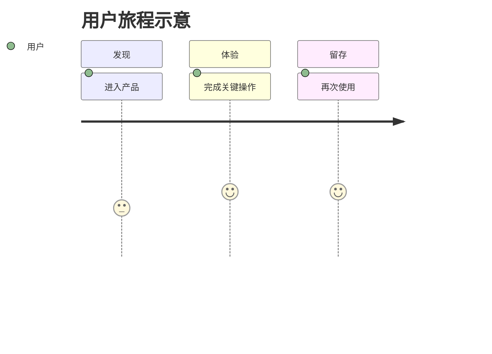
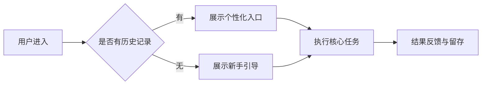
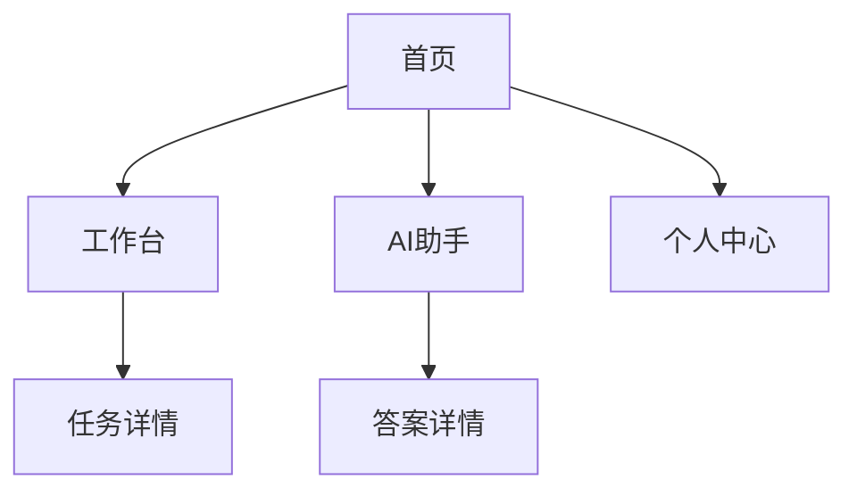
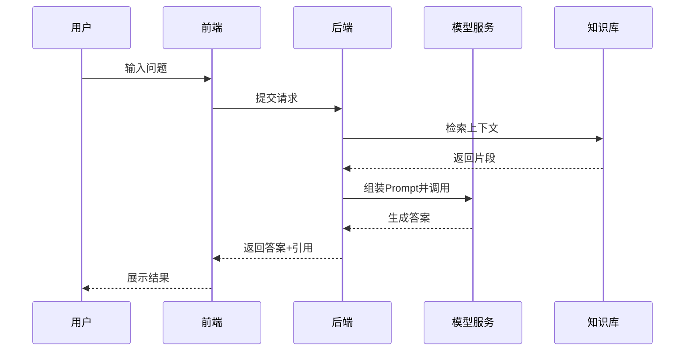
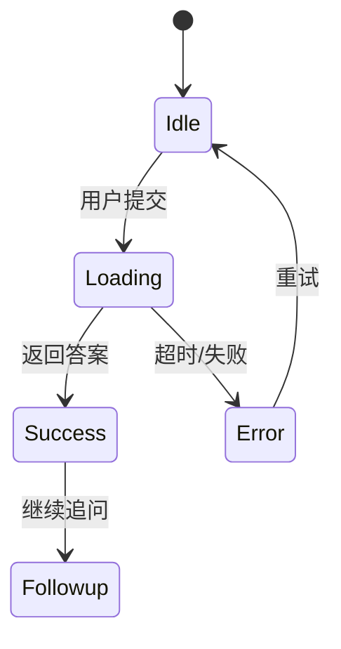

# 产品需求文档（PRD）模板 - AI 时代版本

> 用途：用于需求备份、跨团队对齐、指导设计/研发/测试/运维协作。
> 建议：本模板与交互原型 `prd-prototype.html` 配套使用。

---

## 0. 文档信息

- 产品名称：
- 项目代号：
- 负责人（PM）：
- 版本号：v0.1.0
- 状态：草稿 / 评审中 / 已确认 / 已上线
- 创建日期：YYYY-MM-DD
- 最近更新：YYYY-MM-DD
- 关联文档：竞品分析、技术方案、测试用例、埋点方案、复盘报告

### 0.1 版本记录

| 版本 | 日期 | 修改人 | 变更内容 | 影响范围 |
|---|---|---|---|---|
| v0.1.0 | YYYY-MM-DD | PM姓名 | 初稿创建 | 全量 |

---

## 1. 背景与目标

### 1.1 项目背景

- 当前问题：
- 业务机会：
- 为什么现在做（时机）：

### 1.2 目标与指标（建议 SMART）

- 业务目标：
- 用户目标：
- 系统目标：

| 指标 | 基线 | 目标值 | 统计口径 | 统计周期 |
|---|---:|---:|---|---|
| 例：关键流程转化率 | 18% | 25% | 完成关键动作人数/进入流程人数 | 周 |
| 例：AI 首轮解决率 | 42% | 60% | 无需人工转接的会话占比 | 周 |

### 1.3 范围边界

**In Scope**
- 

**Out of Scope**
- 

---

## 2. 用户与场景

### 2.1 用户角色

| 角色 | 特征 | 核心诉求 | 使用频率 |
|---|---|---|---|
| 主要用户 |  |  |  |
| 管理员 |  |  |  |

### 2.2 核心场景

| 场景ID | 场景描述 | 触发条件 | 成功定义 |
|---|---|---|---|
| SCN-001 |  |  |  |

### 2.3 用户旅程（模板）

---

## 3. 需求清单（功能需求）

### 3.1 需求总览

| 需求ID | 模块 | 需求标题 | 优先级 | 负责人 | 状态 |
|---|---|---|---|---|---|
| REQ-001 | 登录/注册 | 支持手机号验证码登录 | P0 | PM/研发 | 待开发 |
| REQ-002 | AI助手 | 支持智能问答与追问 | P0 | PM/研发 | 待开发 |
| REQ-003 | 工作台 | 支持任务列表筛选 | P1 | PM/研发 | 待开发 |

### 3.2 需求详情（逐条）

#### REQ-001 支持手机号验证码登录

- 目标：降低注册门槛，提高首登转化。
- 触发入口：登录页。
- 前置条件：手机号格式合法。
- 业务规则：
  1. 验证码 60 秒内不可重复发送。
  2. 单手机号每日最多发送 10 次。
- 异常处理：
  1. 发送失败提示“网络异常，请稍后重试”。
  2. 触发风控时要求图形验证。
- 验收标准（可测试）：
  1. 输入合法手机号后可收到验证码。
  2. 倒计时结束前按钮不可重复点击。
  3. 错误验证码提示明确且不泄露安全信息。
- 埋点：`login_sms_send_click`, `login_sms_verify_success`。

#### REQ-002 支持智能问答与追问

- 目标：提升问题解决率，减少人工介入。
- 触发入口：AI 助手输入框。
- 输入输出：
  - 输入：自然语言问题 + 上下文。
  - 输出：答案、引用来源、可追问建议。
- 业务规则：
  1. 高风险问题必须触发免责声明。
  2. 无法回答时必须给出转人工入口。
- 异常处理：
  1. 超时返回“当前繁忙，请稍后再试”。
  2. 低置信度时优先返回澄清问题。
- 验收标准（可测试）：
  1. 首轮响应时间 P95 < 4s。
  2. 低置信度答案不可直接给确定性结论。
  3. 每条回答均可追踪引用来源。
- 埋点：`ai_query_submit`, `ai_answer_view`, `ai_transfer_human_click`。

---

## 4. 非功能需求（NFR）

| 类别 | 指标/要求 | 目标值 | 验收方式 |
|---|---|---|---|
| 性能 | 页面首屏加载 | P95 < 2s | 前端监控 |
| 稳定性 | 可用性 | >= 99.9% | 监控平台 |
| 安全 | 敏感数据保护 | 脱敏/最小化采集 | 安全评审 |
| 可观测性 | 日志追踪 | 请求全链路 traceId | 日志平台 |

---

## 5. AI 专项（必填）

### 5.1 能力边界

- 能做：
- 不能做：
- 禁止场景：

### 5.2 Prompt 与工作流策略

- 系统 Prompt 原则：
- 检索增强（RAG）策略：
- 工具调用策略：
- 多轮会话记忆策略：

### 5.3 评估体系

| 维度 | 指标 | 目标 | 说明 |
|---|---|---|---|
| 模型效果 | 准确率 | >= 85% | 基于标注集 |
| 业务结果 | 任务完成率 | >= 60% | 业务闭环指标 |
| 体验 | 用户满意度 | >= 4.3/5 | 问卷或反馈 |
| 成本 | 单次调用成本 | <= 0.XX 元 | 含模型与检索 |
| 时延 | P95 响应时延 | < 4s | 线上监控 |

### 5.4 兜底与降级

- 模型不可用：切换规则引擎/FAQ。
- 低置信度：先澄清，再回答。
- 高风险请求：强制转人工。

### 5.5 风险与治理

- 幻觉风险：引用来源强约束 + 抽样质检。
- 隐私风险：PII 检测与脱敏。
- 合规风险：敏感行业词库与审核流程。
- 审计要求：保留关键决策日志与版本记录。

---

## 6. 数据与埋点

### 6.1 关键事件

| 事件名 | 触发时机 | 关键属性 | 用途 |
|---|---|---|---|
| `page_view` | 页面曝光 | page_id, source | 漏斗分析 |
| `action_click` | 关键按钮点击 | action_id, req_id | 行为分析 |
| `ai_answer_view` | 展示 AI 回答 | confidence, latency_ms | AI 评估 |

### 6.2 数据字典（示例）

| 字段名 | 类型 | 示例 | 说明 |
|---|---|---|---|
| req_id | string | REQ-002 | 需求追踪 ID |
| trace_id | string | abc123 | 全链路追踪 |
| user_id | string | u_10086 | 用户标识（脱敏） |

---

## 7. 图示（建议至少 4 张）

### 7.1 业务流程图（现状 vs 目标）

### 7.2 信息架构图

### 7.3 系统交互图

### 7.4 状态机（可选）

---

## 8. 发布与验收

### 8.1 里程碑

| 阶段 | 时间 | 目标 | 负责人 |
|---|---|---|---|
| 需求冻结 | YYYY-MM-DD | 完成评审与排期 | PM |
| 开发联调 | YYYY-MM-DD | 主流程可跑通 | RD |
| 灰度发布 | YYYY-MM-DD | 小流量验证 | RD/OP |
| 全量发布 | YYYY-MM-DD | 指标达标 | 全员 |

### 8.2 验收清单

- 功能验收：所有 P0 需求通过。
- 性能验收：核心接口 P95 达标。
- AI验收：准确率/满意度/兜底策略达标。
- 数据验收：埋点完整、口径对齐。
- 安全验收：隐私、权限、审计通过。

### 8.3 回滚方案

- 回滚触发条件：关键指标连续 X 分钟异常。
- 回滚动作：
  1. 关闭新流量入口。
  2. 回滚到上一个稳定版本。
  3. 切换 AI 到兜底策略。

---

## 9. 附录

### 9.1 术语表

| 术语 | 定义 |
|---|---|
| PRD | 产品需求文档 |
| RAG | 检索增强生成 |
| HITL | Human-in-the-loop |

### 9.2 需求追踪矩阵（建议）

| 需求ID | 原型页面 | 接口/服务 | 测试用例 | 埋点事件 |
|---|---|---|---|---|
| REQ-001 | 登录页 | `/api/auth/sms` | TC-001 | `login_sms_send_click` |
| REQ-002 | AI助手页 | `/api/ai/ask` | TC-010 | `ai_query_submit` |

---

## 10. 使用建议（AI时代）

- 文档不是终点，`需求ID` 必须贯穿原型、代码、测试、埋点和复盘。
- 每条需求至少包含：目标、规则、异常、验收、埋点。
- 区分“模型效果指标”和“业务结果指标”，避免只优化模型分数。
- 默认设计降级路径，确保 AI 失效时主流程仍可用。
- 建议每周维护版本记录，形成可审计的需求演进历史。
